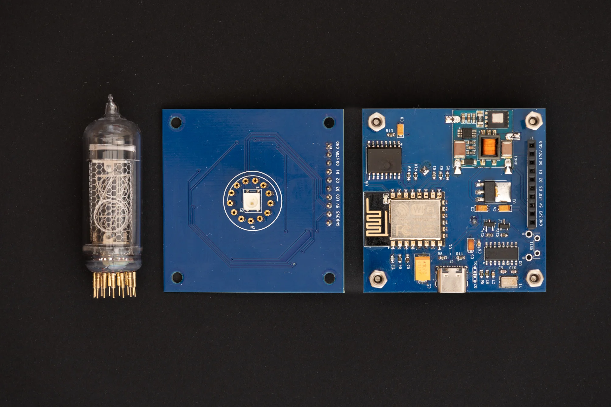

# Single Digit Nixie Clock

A small project combining ESP32 with a vintage Soviet Nixie tube from the 70’ to create an artistic clock.
Originally developed on ESP8266/Arduino, now evolved to ESP32 with ESP-IDF for greater performance and stability.

Huge thank you to **[PCBWay](https://www.pcbway.com)** for sponsoring this project!

For more details follow project logs on: **[my personal blog](https://deni90.github.io/projects/singledigitnixieclock/)** or **[hackaday.io](https://hackaday.io/project/202115-single-digit-nixie-clock)**

Some of the key features:
- Shows current time (hours and minutes) on a single nixie tube.
- Configurable RGB LED backlight lights up the nixie tube every second.
- USB powered.
- Hosts a web server for easy setup & configuration.
- Synchronises time with NTP server.

Operating modes:
- AP mode
  - This mode is hosting a dedicated open wifi network called `NixieClock`. Its main purpose is to use it for first time setup to update wifi configuration. In addition, this mode will be activated when the clock is not able to connect to a configured network. Clock hosts a captive portal. A configuration page will be opened automatically upon connecting to `NixieClock` network.
- Client mode
  - In this mode the clock is connected to a configured wifi network. If there is internet access, the clock will synchronize its RTC with NTP server at startup and then every hour periodically.

In both modes, the configuration page is easily reachable on the following URL: `<HOSTNAME>.local`. There is no need to keep track of the IP address, the clock is hosting Multicast DNS (mDNS) server. mDNS is supported by Chrome and Safari browsers out of the box.

By default, the `HOSTNAME` is set to `mynixieclock`.

## Firmware

This project started on ESP8266 with the Arduino framework, which was great for fast prototyping. However, the reliance on third-party libraries often led to instability and crashes.

To ensure long-term support and stability, the project was migrated from the now-obsolete ESP8266 to the ESP32, using ESP-IDF in C++.

This move provides:
- A robust and stable firmware base.
- Full access to ESP32’s hardware features.
- Use of official ESP-IDF components

### REST API

| End point | Method | Body (JSON) | Description |
| - | - | - | - |
| /api/v1/led/led_info | GET | { &nbsp;&nbsp;&nbsp;&nbsp;“R”: <0-255>, &nbsp;&nbsp;&nbsp;&nbsp;“G”: <0-255>, &nbsp;&nbsp;&nbsp;&nbsp;“B”: <0-255>, &nbsp;&nbsp;&nbsp;&nbsp;“state”: <0-2> } | Get color and state of the backlight (RGB LED). |
| /api/v1/led/led_info | POST | { &nbsp;&nbsp;&nbsp;&nbsp;“R”: <0-255>, &nbsp;&nbsp;&nbsp;&nbsp;“G”: <0-255>, &nbsp;&nbsp;&nbsp;&nbsp;“B”: <0-255>, &nbsp;&nbsp;&nbsp;&nbsp;“state”: <0-2> } | Set color and state of the backlight (RGB LED). |
| /api/v1/clock/sleep_info | GET | { &nbsp;&nbsp;&nbsp;&nbsp; “sleep_before”: \<value>, &nbsp;&nbsp;&nbsp;&nbsp; “sleep_after”: \<value> } | Get sleep mode configuration. The time before and after (in minutes) the backlight will be turned off. |
| /api/v1/clock/sleep_info | POST | { &nbsp;&nbsp;&nbsp;&nbsp; “sleep_before”: \<value>, &nbsp;&nbsp;&nbsp;&nbsp; “sleep_after”: \<value> } | Set sleep mode configuration. |
| /api/v1/clock/time_info | GET | { &nbsp;&nbsp;&nbsp;&nbsp;"tz_zone": "\<Geographic zone>", &nbsp;&nbsp;&nbsp;&nbsp;“tz_offset”: “\<Proleptic TZ>" } | Get time zone configuration |
| /api/v1/clock/time_info | POST | { &nbsp;&nbsp;&nbsp;&nbsp;"tz_zone": "\<Geographic zone>", &nbsp;&nbsp;&nbsp;&nbsp;“tz_offset”: “\<Proleptic TZ>" } | Set time zone configuration |
| /api/v1/wifi/wifi_info | GET | { &nbsp;&nbsp;&nbsp;&nbsp;"hostname": "\<HOSTNAME>", &nbsp;&nbsp;&nbsp;&nbsp;“SSID”: “\<Wifi SSID>”,&nbsp;&nbsp;&nbsp;&nbsp;  &nbsp;&nbsp;&nbsp;&nbsp;“password”: “\<base64 encoded password>” } | Get wifi configuration. |
| /api/v1/wifi/wifi_info | POST | { &nbsp;&nbsp;&nbsp;&nbsp;"hostname": "\<HOSTNAME>", &nbsp;&nbsp;&nbsp;&nbsp;“SSID”: “\<Wifi SSID>”,&nbsp;&nbsp;&nbsp;&nbsp;  &nbsp;&nbsp;&nbsp;&nbsp;“password”: “\<base64 encoded password>” } | Set wifi configuration. | Set wifi configuration. |

### Front-end layout & design

Initially, the front end was implemented with jQuery mobile. Reason for choosing this framework was in its simplicity. It provides a simple way to create and control user interface components. One thing that always annoyed me was its low response time. It took too much time to load jQuery, jQueryMobile and theme resources. On top of this, this slow response time caused WDT resets.

One more thing, I just realised that  jQuery mobile project is deprecated since October 7, 2021. Huh, when it comes to web related technologies, it looks like I'm living under a rock...

To solve these issues, I opted to completely re implement the frontend using plain HTML, CSS and JavaScript. The end result looks almost the same as the previous design or even better. Responsiveness and stability increased significantly. The only drawback is now in maintenance and extension. It is required to implement everything manually.

## Design

Schematic and PCB are designed with KiCAD

### Control board

Control board is basically a re-packaged generic ESP32 board design connected with DS3231 real time clock and NCH8200HV high voltage boost module board.

#### Schematic

### Display board

Display board uses a CD4028 BCD-to-decimal decoder. Its purpose is to reduce the number of required GPIO pins from 10 to just 4 for showing digits from 0 to 9. Compared to dedicated BCD to decimal decoder nixie drivers (like K511ID1), the CD4028 is a widely spread component and it is available in SMD package. Since CD4028 has a voltage range from 3.0V to 15V it is not compatible with nixie tube’s operating voltage of 170V out of the box. This problem is solved with MMBTA42, a high voltage transistor, rated to more than 200V.

The rest of the display board consists of a WS2812B RGB LED and a pin header used to connect with the control board.

#### Schematic

## PCB manufacturing

A representative from **PCBWay** contacted me because he was deeply impressed by my project and offered to sponsor a batch of PCBs to test out their services.

Since I recently moved to KiCad, it was a perfect opportunity to try out the PCBWay Plug-in for KiCad. It provides a simple way to place an order in just a few clicks. There is no need to bother with exporting gerber files, everything is automated. You just need to update the PCB specification and fill in the shipping information on the webpage. That’s it.

The entire journey from placing the order to receiving the package took less than a week. Incredible! PCBWay did a superb job, PCBs are amazing. I am more than impressed.

## Enclosure design

3D model is made with Autodesk Fusion 360.

The end result is a simple box shaped design with holes for the nixie tube and USB connector.

## Third-party dependencies

This project includes `firmware/flash_data/frontend/zones.json` from https://github.com/nayarsystems/posix_tz_db, licensed under the MIT License.

## Resources

* [IN-14 Nixie tube datasheet](https://tubehobby.com/datasheets/in14.pdf)
* [NCH8200HV High Voltage DC-DC Booster module](http://omnixie.io/nch8200hv.html)
* [CD4028 datasheet](https://www.renesas.com/en/document/dst/cd4028bms-datasheet?srsltid=AfmBOoqU2NILPd5EzyLmpNgOihDv6LZo1jPMcaXfnR6dCclXbg2DF4TL)
